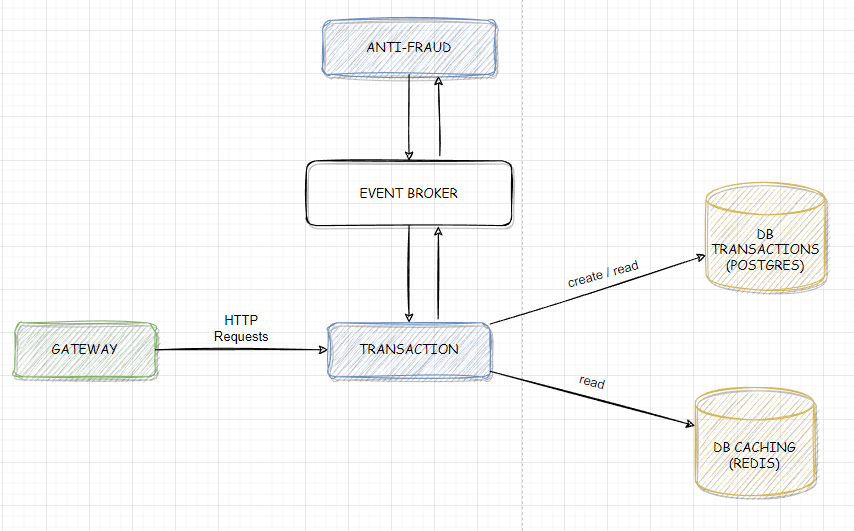
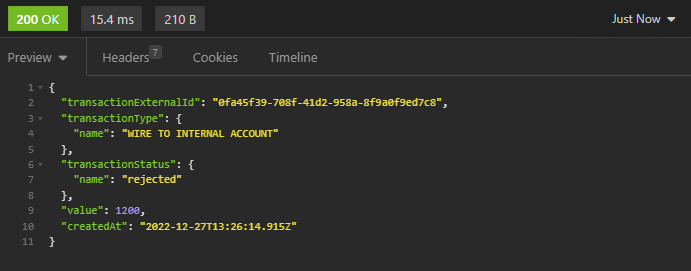

# Yape Code Challenge :rocket:

- [Problem](#problem)
- [Tech Stack](#tech_stack)
- [Send us your challenge](#send_us_your_challenge)

# Problem

Every time a financial transaction is created it must be validated by our anti-fraud microservice and then the same service sends a message back to update the transaction status.
For now, we have only three transaction statuses:

<ol>
  <li>pending</li>
  <li>approved</li>
  <li>rejected</li>  
</ol>

Every transaction with a value greater than 1000 should be rejected.

```mermaid
  flowchart LR
    Transaction -- Save Transaction with pending Status --> transactionDatabase[(Database)]
    Transaction --Send transaction Created event--> Anti-Fraud
    Anti-Fraud -- Send transaction Status Approved event--> Transaction
    Anti-Fraud -- Send transaction Status Rejected event--> Transaction
    Transaction -- Update transaction Status event--> transactionDatabase[(Database)]
```

# Tech Stack

<ol>
  <li>Node. You can use any framework you want (i.e. Nestjs with an ORM like TypeOrm or Prisma) </li>
  <li>Any database</li>
  <li>Kafka</li>    
</ol>

We do provide a `Dockerfile` to help you get started with a dev environment.

You must have two resources:

1. Resource to create a transaction that must containt:

```json
{
  "accountExternalIdDebit": "Guid",
  "accountExternalIdCredit": "Guid",
  "tranferTypeId": 1,
  "value": 120
}
```

2. Resource to retrieve a transaction

```json
{
  "transactionExternalId": "Guid",
  "transactionType": {
    "name": ""
  },
  "transactionStatus": {
    "name": ""
  },
  "value": 120,
  "createdAt": "Date"
}
```

## Optional

You can use any approach to store transaction data but you should consider that we may deal with high volume scenarios where we have a huge amount of writes and reads for the same data at the same time. How would you tackle this requirement?

You can use Graphql;

# Challenge

## Diagram
1. The flow starts when the client makes an HTTP request to Gateway, then the Gateway makes a request to Transaction Microservice
2. Transaction Microservice save the data and send a message to Anti Fraud Microservice through Event Broker
3. Anti-Fraud Microservice validates the message and send a new message with status to Transaction Microservice
4. Transaction Microservice receive the message and updates the register with the new status
5. When the Gateway makes a GET request, the first time the Transaction Microservice find the register in database and store it 
in cache with Redis, then all requests to the same resource will be requested to Redis


## API
``` 
POST -> http://localhost:3000/transaction/
body {
	"accountExternalIdCredit": "b01ce0ef-34ab-4c21-94bc-c48c70003867",
	"accountExternalIdDebit": "439e8f6e-c1c2-41b5-a69f-7bd93e8b35a7",
	"tranferTypeId": 3,
	"value": 1200
}
GET -> http://localhost:3000/transaction/:id

```

## Setup project
1. set env variables
2. run scripts
```
> docker compose up -d --build
> npm run build
> npm run start:gateway
> npm run start:transaction
> npm run start:antifraud
```

## Result with transaction value = 500
1. started servers


2. Send a POST request with transaction data


3. Transaction Microservice send and receive the message


4. Anti-Fraud Microservice send and receive the message


5. GET request


## Result with transaction value = 1200

1. Send a POST request with transaction data


2. Transaction Microservice send and receive the message


3. Anti-Fraud Microservice send and receive the message


4. GET request




